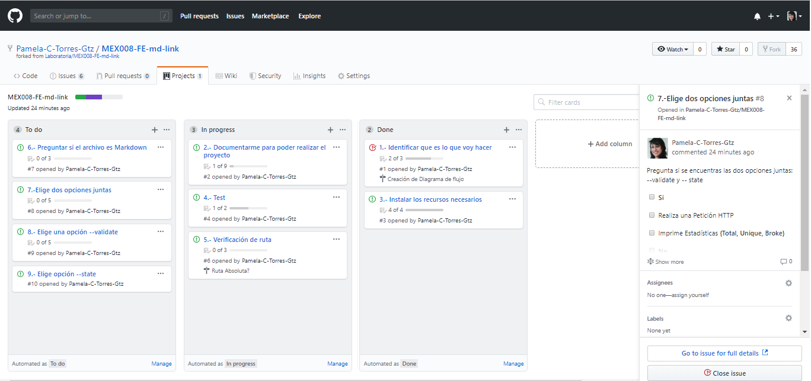
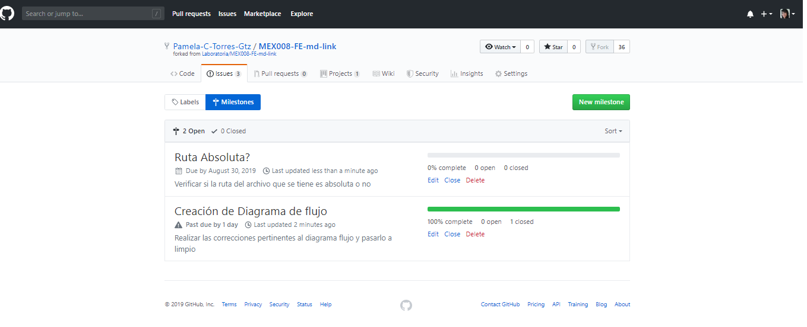

# Markdown Links

## Índice

* [1. Preámbulo](#1-preámbulo)
* [2. Algoritmo](#2-algoritmo)
* [3. Board del Backlog](#3-board-del-backlog)

***

## 1. Preámbulo

Esta librería `md-links` es una herramienta creada en Node.js que lee y analiza archivos con extensión de formato `.md` (Markdown), con el objetivo de verificar los links contengan y reportar sus estadísticas de validación.

## 2. Algoritmo

El siguiente diagrama se creo utilizando la herramienta web de Lucidchart, de esta forma grafica se muestra la lógica de la librería, tratando de dar una idea estructurada de la misma.

![diagramaFlujo]https://github.com/Pamela-C-Torres-Gtz/MEX008-FE-md-link/blob/master/img/dIagramaFlujo.png)

## 3. Board del Backlog

El proyecto se encuentra alojado en GitHub, esto nos permite aprobechar su herramienta de organización y planificación para los proyectos.

Haciendo uso de milestones e issues (por sprint), se asignan tareas por funciones, dentro de estas funcones se pueden realizar tareas más pequeñas todo por medio de un checklist.

- Project

- Milestones

