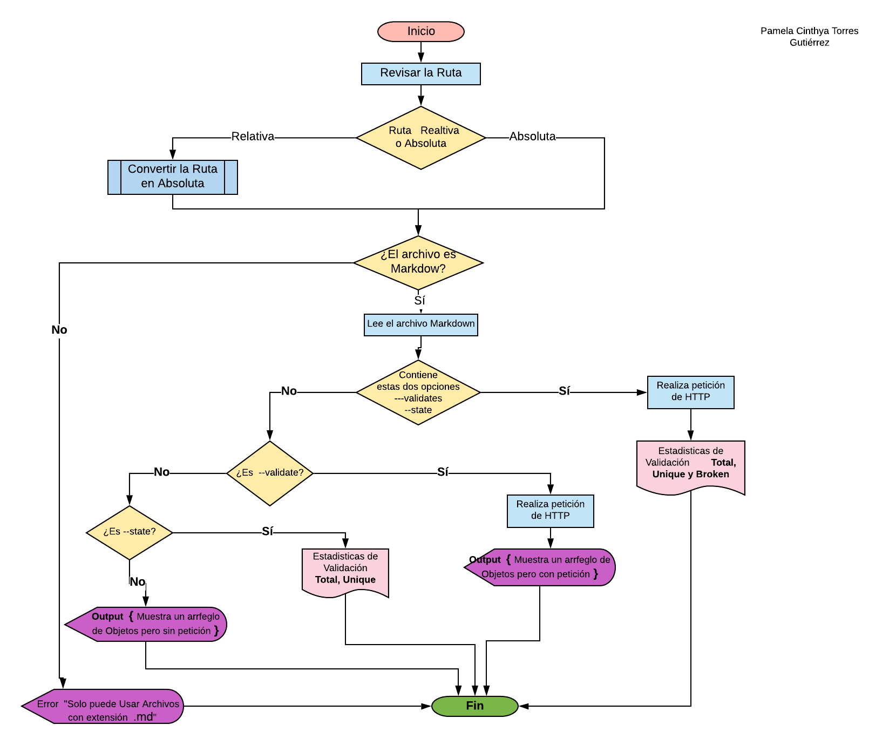

# Markdown Links

## Índice

* [1. Preámbulo](#1-preámbulo)
* [2. Instalación](#2-instalación)
* [3. API](#3-api)
* [4. TEST-JEST](#3-test-jest)
* [5. CLI (Command Line Interface)](#4-cli-(command-line-interface))
* [6. Algoritmo](#3-algoritmo)
* [7. Board del Backlog](#3-board-del-backlog)

***

## 1. Preámbulo

Esta librería `md-links` es una herramienta creada en Node.js que lee y analiza archivos con extensión de formato `.md` (Markdown), con el objetivo de verificar los links contengan y reportar sus estadísticas de validación.

## 2. Instalación

1. Abra su consola git y en ella introduzca cualquiera de los siguientes comandos para realizar la instalación de manera global:
```js
   $ npm i -g Pamela-C-Torres-Gtz/MEX008-FE-md-link
   ```
                   ó
```js                   
   $ npm install Pamela-C-Torres-Gtz/md-links
   ```

2. En caso de contar con alguna version de Linux colocar el siguiente comando:
```js
   $ sudo npm i -g Pamela-C-Torres-Gtz/MEX008-FE-md-link
   ```
                   ó
```js                   
   $sudo npm install Pamela-C-Torres-Gtz/md-links.
```


### 3. API

#### `mdLinks(path, options)`

##### Argumentos

- `path`: Ruta absoluta o relativa al archivo o directorio. 
- `options`: Un objeto con las siguientes propiedades:
  * `validate`: Booleano que determina si se desea validar los links
    encontrados.

##### Valor de retorno

Cada objeto representa un link y contiene
las siguientes propiedades:

- `href`: URL encontrada.
- `text`: Texto que aparecía dentro del link (`<a>`).
- `route`: Ruta del archivo donde se encontró el link.

#### Ejemplo

```js
const mdLinks = require("md-links");

mdLinks("./some/example.md")
  .then(links => {
    // => [{ href, text, file }]
  })
  .catch(console.error);

mdLinks("./some/example.md", { validate: true })
  .then(links => {
    // => [{ href, text, file, status, ok }]
  })
  .catch(console.error);

mdLinks("./some/dir")
  .then(links => {
    // => [{ href, text, file }]
  })
  .catch(console.error);
```


## 4. TEST-JEST

####  Ejecución de TEST 

 Este proyecto cuenta con test desarrollados en Jest-Js para la validación de las funciones, los cuales se pueden ejecutar de la siguiente manera:

Ejemplo de ejecución de test de manera global.

 ```js
 $ npm test
 ```

 ```js
 $ npm run test
 ```

 ```js
 $ npm t
 ```

 Ejemplo de ejecución de algus test en especifico.

 ```js
 $ npm test path.test.js
 ```

 ```js
 $ npm run test path.test.js
 ```

 ```js
 $ npm t path.test.js
 ```


## 5. CLI (Command Line Interface)
El ejecutable podra ejecutarse de la siguiente manera a través de la terminal:

`md-links <path-to-file> [options]`

Por ejemplo:

```js
$ md-links ./some/example.md --validate
$ md-links ./some/example.md --stats
$ md-links ./some/example.md --v --s
```

## Opciones
`--validate`

Si pasamos la opción --validate, el módulo debe hacer una petición HTTP para averiguar si el link funciona o no. Si el link resulta en una redirección a una URL que responde ok, entonces consideraremos el link como ok.

Por ejemplo:

```js
$ md-links ./some/example.md --validate
./some/example.md http://algo.com/2/3/ ok 200 Link a algo
./some/example.md https://otra-cosa.net/algun-doc.html fail 404 algún doc
./some/example.md http://google.com/ ok 301 Google
```

El _output_ en este caso incluye la palabra `ok` o `fail` después de
la URL, así como el status de la respuesta recibida a la petición HTTP a dicha
URL.

`--stats`

Si pasamos la opción --stats, el output (salida) será un texto con estadísticas básicas sobre los links.

```js
$ md-links ./some/example.md --stats
Total: 3
Unique: 3
```

`--stats --validate` 

También podemos combinar --stats y --validate para obtener estadísticas que necesiten de los resultados de la validación.

```js
$ md-links ./some/example.md --stats --validate
Total: 3
Unique: 3
Broken: 1
```

## 6. Algoritmo

El siguiente diagrama se creo utilizando la herramienta web de Lucidchart, de esta forma grafica se muestra la lógica de la librería, tratando de dar una idea estructurada de la misma.




## 7. Board del Backlog

El proyecto se encuentra alojado en GitHub, esto nos permite aprobechar su herramienta de organización y planificación para los proyectos.

Haciendo uso de milestones e issues (por sprint), se asignan tareas por funciones, dentro de estas funcones se pueden realizar tareas más pequeñas todo por medio de un checklist.

- Project


- Milestones

